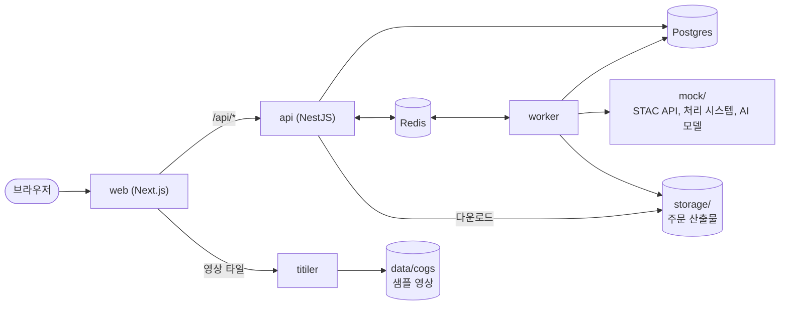

# Footprint

위성영상 마켓플레이스를 직접 만들어 보면서 GIS를 공부하는 개인 프로젝트다.

고객은 지도에서 위성영상을 찾고 필요한 영역만 잘라서 주문한다. 운영자는 같은 앱의 백오피스에서 카탈로그 수집, 주문 처리, 촬영 요청, 가격을 관리한다. 흐름은 Planet Explorer와 UP42를 참고했고 데이터는 실제 Sentinel-1, Sentinel-2의 STAC 메타데이터와 COG 영상이다.

위성영상 플랫폼 개발 공고에 나오는 일을 하나씩 다 해 보는 게 목표다. 영상 뷰어, 지도, 검색 필터, 다운로드, AI 모델 연동과 분석 파이프라인, 외부 시스템 연동, 성능 개선, 장애 대응, 기업 고객 기능까지. 클라우드 배포와 CI/CD는 일단 뺐다.

돈 드는 건 안 쓴다. 클라우드 계정이나 API 키 없이 노트북에서 전부 돌아가고, 외부 시스템은 `mock/`에 흉내 서버를 만들어 대신한다. 파일도 S3 말고 로컬 디스크에 둔다. 인프라 설정보다 코드 짜는 데 시간을 쓰고 싶어서 그렇게 했다.

## 실행

Node 22 이상, pnpm, Docker가 있어야 한다.

```bash
pnpm install
cp apps/api/.env.example apps/api/.env
docker compose up -d --wait
pnpm --filter @footprint/api db:migrate
pnpm dev
```

web은 http://localhost:3000 이고 Swagger는 http://localhost:3001/api/docs 에 있다. 나머지 명령어는 [docs/development.md](docs/development.md)에 있다.

## 구조



- api와 worker는 같은 NestJS 코드고 진입점만 다르다(`src/main.ts`, `src/worker.ts`). 수집이나 주문 처리처럼 오래 걸리는 일은 BullMQ 큐에 넣고 worker가 처리한다.
- web이 `/api/*`를 api로 넘겨 주기 때문에 브라우저 입장에서는 origin이 하나다. CORS 설정이 필요 없다.
- titiler는 `data/cogs`에 있는 샘플 영상을 지도 타일로 쪼개 주고 원하는 영역을 잘라 준다.
- 인프라는 필요한 단계가 됐을 때 `compose.yaml`에 하나씩 넣는다. 지금은 Postgres(PostGIS)만 있다.

## 스택

- web: Next.js 16, Tailwind 4, shadcn/ui, TanStack Query/Table, nuqs, zustand, react-hook-form, zod, MapLibre GL, terra-draw
- api: NestJS 12, Prisma 7, class-validator, zod, BullMQ, pino
- 인프라: Postgres 18 + PostGIS 3.6, Redis, titiler

## 로드맵

GIS 쪽이 먼저 궁금해서 1, 2, 3, 11, 12, 16 순서로 먼저 간다. 단계마다 할 일은 [docs/roadmap.md](docs/roadmap.md)에 적어 뒀다.

- [ ] 1. 카탈로그 적재
- [ ] 2. 영상 검색 API
- [ ] 3. 탐색 화면
- [ ] 4. 인증과 역할
- [ ] 5. 사용자 관리
- [ ] 6. 상품 관리와 수집
- [ ] 7. 장바구니와 가격
- [ ] 8. 주문과 처리
- [ ] 9. 주문 관리
- [ ] 10. 대시보드
- [ ] 11. 고급 지도 도구
- [ ] 12. 영상 뷰어
- [ ] 13. 촬영 요청
- [ ] 14. 모니터링과 알림
- [ ] 15. AI 분석
- [ ] 16. PostGIS 성능
- [ ] 17. 운영과 안정화
- [ ] 18. 기업 고객 기능

## 문서

- [docs/spec.md](docs/spec.md): 역할, 도메인 모델, 상태 전이, API 규칙, 데이터
- [docs/roadmap.md](docs/roadmap.md): 단계별 할 일
- [docs/decisions.md](docs/decisions.md): 왜 이렇게 정했는지
- [docs/development.md](docs/development.md): 개발 환경과 명령어

`mock/` 소스와 `docs/answers/`는 해당 단계를 끝내고 나서 연다. 데이터가 지저분한 부분이나 mock이 이상하게 구는 건 직접 부딪혀 봐야 공부가 된다.

## 라이선스

코드는 [MIT](LICENSE) 라이선스다. `data/`의 데이터는 원본 라이선스를 따르고 출처와 표시 문구는 [data/README.md](data/README.md)에 있다.
